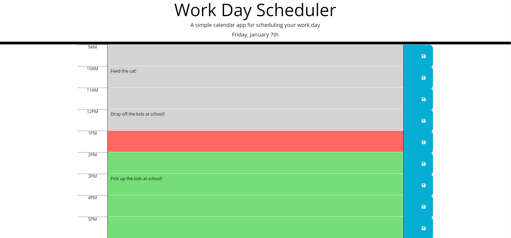

# day-planner

## Description

A daily scheduler designed to help a user plan out their work day activities. The background color of each textbox will change either gray, red, or green according to the current time. Text inputted in the designated hour blocks will be saved into the local storage and will display on load.

## [Try it yourself!](https://maestroluu.github.io/day-planner/)
 
The following images show a glimpse of the application:

## Getting Started

This is a simple application that runs right in the browser, no installation or downloads needed.

## Built With:

HTML  
JQUERY 
MOMENT 
CSS

## Author:

David Luu

## Planned Updates

No further updates have been planned at this time.